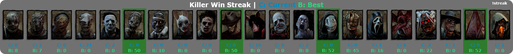
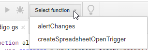

# Killer Streak Overlay - Dead By Daylight

This was created for [Otzdarva's Twitch Stream](https://bit.ly/3lCy3MN). Otzdarva decided to take on a challenge, winning 50 Killer games in a row in Dead By Daylight. This while playing without Add-ons.

While playing, Otz will update a [public spreadsheet](https://bit.ly/3dizu0b) with data. This data is then process by this service, to display an overlay on his stream with the status of the streak.

It looks something like this:


### How does it work?

This service is using Google Apps Script to send an HTTP Request to a Web Server, so it can notify the client (by a Websocket) that a change has been made.

### Can I use it for my Stream?

Yes! But please consider giving me credit for the work I put in.

### Setup seems complicated, can you host it for me?

If you need a custom version, or a hosted version of this, you can contact me on Discord: [`andre.paulo`](https://discord.com/users/141205037413040128), or join [this server](https://bit.ly/3lFD2MY).

## Setup

### Requirements

* NodeJS (tested in v12.18.4)

### Instalation

1. Clone the repository: `https://github.com/andre-paulo98/dbd-killer-streak.git`.

2. Install NPM dependencies: `npm install`.

3. Copy the example config file to `config.js`.

4. Change the config file with an API key:
   - Go to Google API Console: https://console.developers.google.com/projectcreate
   - Create a new Project.
   - Enable APIS and Services.
   - Search for `sheets`.
   - Select `Google Sheets API`.
   - Press Enable.
   - Go back to the dashboard (Click on icon, in top left).
   - Select Credentials.
   - Create Credentials.
   - Select API Key.
   - Copy that Key to the `config.js` file.

5. Change the ID for the Spreadsheet:
   - Make a copy of Otz's spreadsheet to your account.
   - Share it publicly with a link. Make sure that everyone can see the spreadsheet, (Try in a different browser, or in Incognito mode).
   - Copy the ID, ex: `https://docs.google.com/spreadsheets/d/1PVh8RE3uy88YjdOYPA0Xi35b8ReCDteHZo0lFYKw2HI/edit#gid=0` the ID would be `1PVh8RE3uy88YjdOYPA0Xi35b8ReCDteHZo0lFYKw2HI`
   
6. Setup Google Apps Script to notify on change:
   - Go to Google Scripts page: https://script.google.com/home
   - Make a new Project.
   - Change the title of the project (Recommended).
   - Paste this:
    ```js
    function alertChanges() {
        var response = UrlFetchApp.fetch("<url>/webhook-send-update");
        console.log("response => ", response);
    }
    
    function createSpreadsheetOpenTrigger() {
        var ss = SpreadsheetApp.openById("<spreadsheet ID>");
        ScriptApp.newTrigger('alertChanges')
            .forSpreadsheet(ss)
            .onChange()
            .create();
    }
    ```
   - Change `<url>` and `<spreadsheet ID>` to their respectful values
      - If you aren't running the service behind a proxy (Apache, Nginx), the URL could be the server IP and port, eg: `http://203.0.113.50:3000`, so it would something like this: `UrlFetchApp.fetch("http://203.0.113.50:3000/webhook-send-update");`.
      - You can also run this behind a proxy and change the URL appropriately.
      - Spreadsheet ID is the same as step **5.**
   - Press `CTRL + S` to save the file.
   - Click `Select Function` and select `createSpreadsheetOpenTrigger`.
   
   
   - Then press the Play button on the left to save the trigger.
   - You'll need to authorize your application parts of your Google Data.
      - Select an account.
      - You'll see a warning that the application was not validated. 
      - Press Advanced and scroll down to the bottom and press `Access to <your application> (insecure)`.
      - Scroll down and press Allow.

    ##### What does this do?
    This will setup in your account a script to notify your service that a change was made in the spreadsheet.

7. Everything should be ready for you to start.
   - Run the script with `node index.js`.
   - If you open on your browser `http://<server IP>:3000/render`, you should see the page.
   
8. If you change a value in the spreadsheet, and it saves it online, it should update automatically on the render page.


